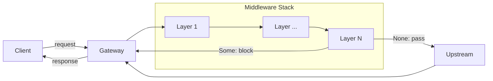
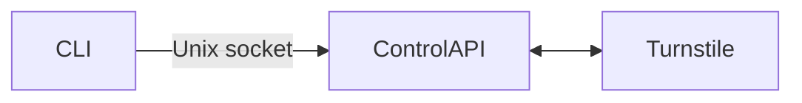

# Architecture

```mermaid
flowchart LR
    Client -->|request| Gateway

    subgraph Middleware [Middleware Stack]
        direction LR
        L1[Layer 1] --> L2[Layer ...] --> LN[Layer N]
    end

    Gateway --> L1
    LN -->|None: pass| Upstream --> Gateway
    LN -->|Some: block| Gateway
    Gateway -->|response| Client
```

## Control Plane

```mermaid
flowchart LR
    CLI -->|Unix socket| ControlAPI
    ControlAPI <--> Turnstile
```
